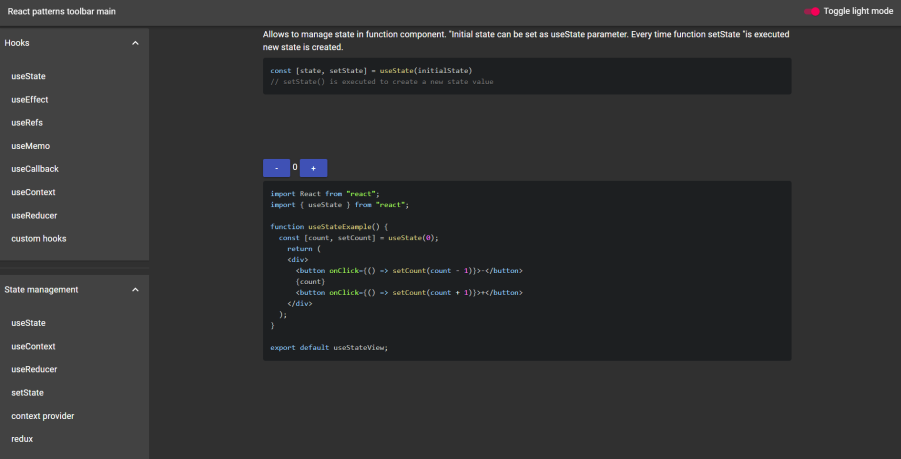

# React-design-patterns

This is not a tutorial app! Just few working examples of most popular design patterns available for react (hooks, redux, react-router etc.). Just select what You need and copy source code into Your's vscode to  start experimenting.

## Working Heroku version below:

[https://react-patterns.herokuapp.com](https://react-patterns.herokuapp.com)

## Left todo
- styling the app
- add more patterns
